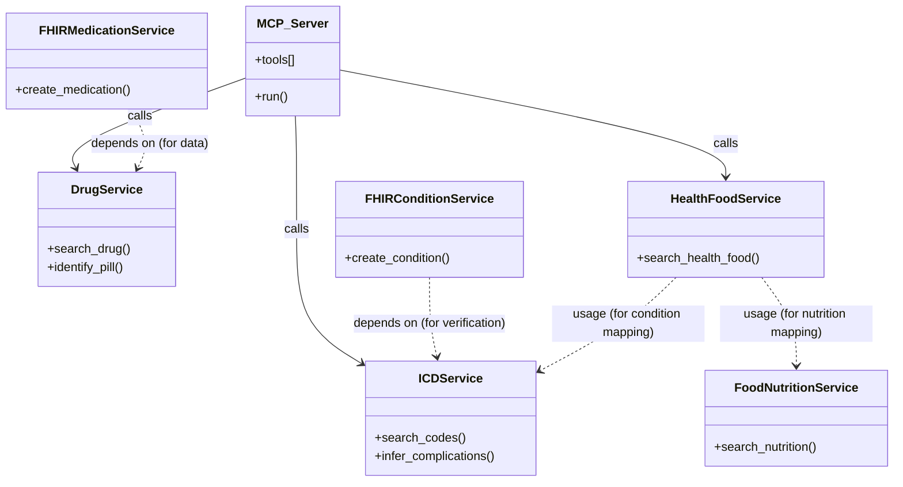

# 模組關係圖

```mermaid
classDiagram
    class MCP_Server {
        +run()
        +tools[]
    }

    class ICDService {
        +search_codes()
        +infer_complications()
    }

    class DrugService {
        +search_drug()
        +identify_pill()
    }

    class FHIRConditionService {
        +create_condition()
    }

    class FHIRMedicationService {
        +create_medication()
    }
    
    class FoodNutritionService {
        +search_nutrition()
    }

    class HealthFoodService {
        +search_health_food()
    }

    MCP_Server --> ICDService : calls
    MCP_Server --> DrugService : calls
    MCP_Server --> HealthFoodService : calls
    
    FHIRConditionService ..> ICDService : depends on (for verification)
    FHIRMedicationService ..> DrugService : depends on (for data)
    
    HealthFoodService ..> ICDService : usage (for condition mapping)
    HealthFoodService ..> FoodNutritionService : usage (for nutrition mapping)
```

## 相依性說明

- **FHIR 服務** 高度依賴基礎資料服務 (`ICDService`, `DrugService`) 來驗證代碼的正確性與獲取詳細描述。
- **Health Food Service** 作為綜合應用層，同時調用了 `ICDService` (確認疾病) 與 `FoodNutritionService` (確認營養成分) 來產生綜合建議。
