# 系統架構

本文件說明 Taiwan ICD10 Health MCP 的完整系統架構設計。

---

## 📐 整體架構

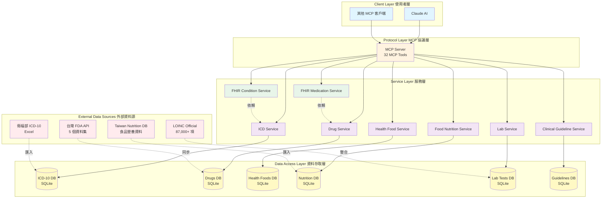

---

## 🏗️ 分層架構

### 1. Client Layer (使用者層)

負責與 MCP Server 進行通訊的客戶端。

| 客戶端 | 說明 |
|--------|------|
| **Claude AI** | 主要客戶端，透過 MCP 協議調用工具 |
| **其他 MCP 客戶端** | 任何支援 MCP 協議的應用程式 |

**特點**:

- ✅ 標準化 MCP 協議
- ✅ 支援多客戶端同時連線
- ✅ 即時回應

---

### 2. Protocol Layer (MCP 協議層)

實作 Model Context Protocol (MCP) 標準。

```python
# MCP Server 初始化
mcp = FastMCP("taiwanHealthMcp")

# 工具註冊範例
@mcp.tool()
def search_medical_codes(keyword: str, type: str = "all") -> str:
    """搜尋 ICD-10 診斷/手術碼"""
    return icd_service.search_codes(keyword, type)
```

**功能**:

- 🔹 32 個 MCP Tools
- 🔹 工具註冊與管理
- 🔹 參數驗證
- 🔹 錯誤處理
- 🔹 日誌記錄

**工具分組**:

| 群組 | 數量 | 說明 |
|------|------|------|
| ICD-10 工具 | 4 | 診斷/手術碼相關 |
| 藥品工具 | 3 | FDA 藥品資料 |
| 健康食品工具 | 2 | 健康食品管理 |
| 營養工具 | 5 | 食品營養分析 |
| FHIR 工具 | 7 | FHIR 資源轉換 |
| 檢驗工具 | 5 | LOINC 與檢驗判讀 |
| 臨床指引工具 | 5 | 診療指引查詢 |
| 綜合分析工具 | 1 | 跨模組整合 |

---

### 3. Service Layer (服務層)

核心業務邏輯實作層。

#### 3.1 ICD Service

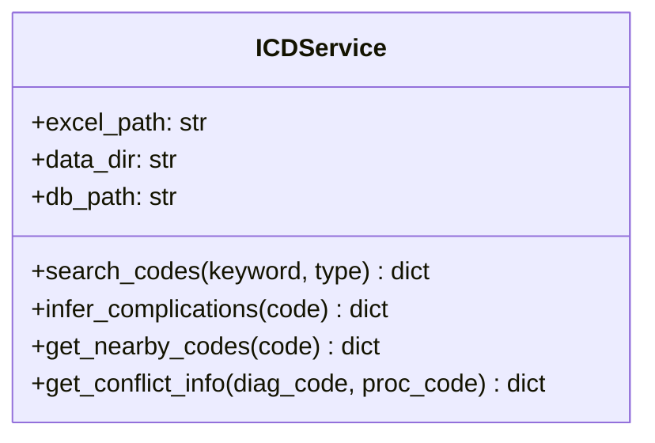

**職責**:

- ICD-10-CM/PCS 資料管理
- 診斷碼搜尋與推論
- FTS5 全文檢索

#### 3.2 Drug Service

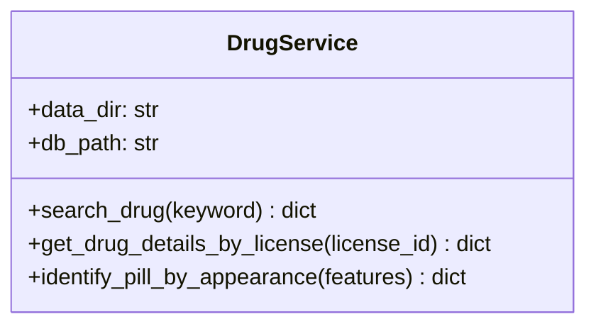

**職責**:

- 整合 5 個 FDA API
- 藥品資料管理
- 外觀識別

#### 3.3 FHIR Services

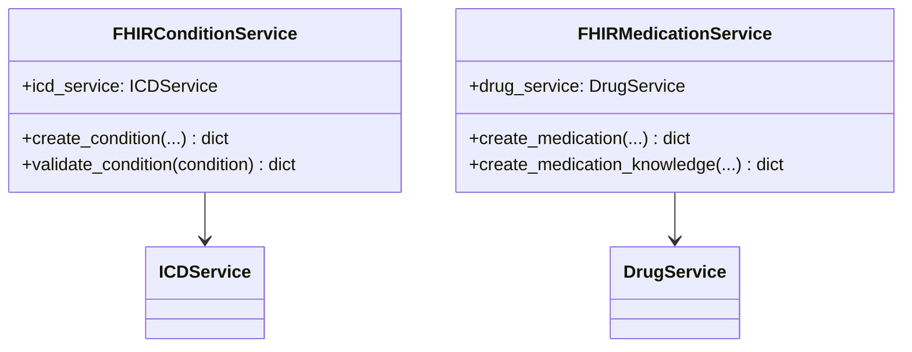

**職責**:

- FHIR R4 資源轉換
- 資源驗證
- 標準化輸出

#### 3.4 Lab Service

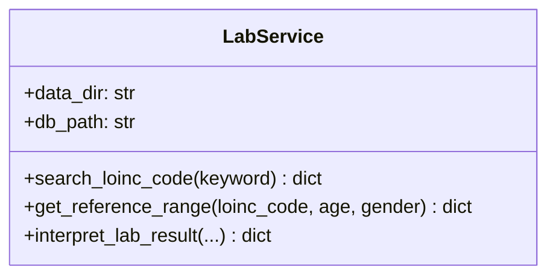

**職責**:

- LOINC 碼管理
- 參考值查詢
- 結果判讀

#### 3.5 Clinical Guideline Service

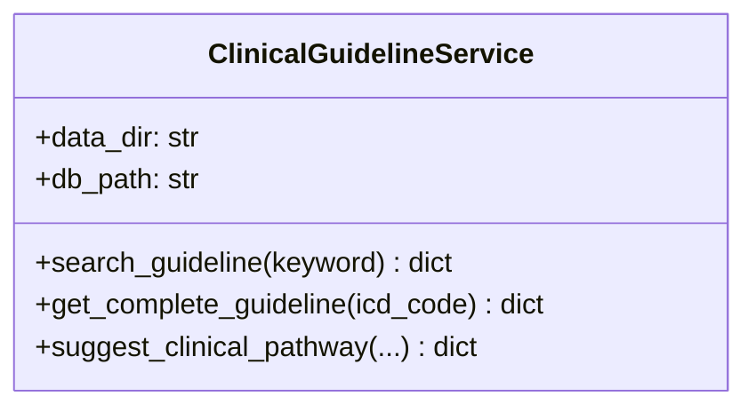

**職責**:

- 臨床指引管理
- 用藥建議
- 臨床路徑規劃

---

### 4. Data Access Layer (資料存取層)

使用 SQLite 資料庫儲存與管理資料。

#### 資料庫架構

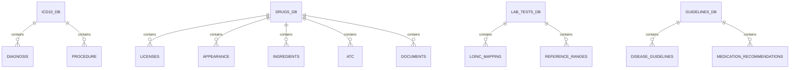

#### 資料表結構

=== "ICD-10 DB"

    | 表名 | 主要欄位 | 索引 |
    |------|---------|------|
    | `diagnosis` | code, name_zh, name_en | code, FTS5 |
    | `procedure` | code, name_zh, name_en | code, FTS5 |

=== "Drugs DB"

    | 表名 | 主要欄位 | 索引 |
    |------|---------|------|
    | `licenses` | license_id, name_zh, indication | license_id, FTS5 |
    | `appearance` | license_id, shape, color, marking | license_id |
    | `ingredients` | license_id, ingredient_name, content | license_id |
    | `atc` | license_id, atc_code | atc_code |

=== "Lab Tests DB"

    | 表名 | 主要欄位 | 索引 |
    |------|---------|------|
    | `loinc_mapping` | loinc_code, loinc_name_zh, category | loinc_code, FTS5 |
    | `reference_ranges` | loinc_code, age_min, age_max, gender, range_low, range_high | loinc_code |

=== "Guidelines DB"

    | 表名 | 主要欄位 | 索引 |
    |------|---------|------|
    | `disease_guidelines` | icd_code, title, publisher | icd_code |
    | `medication_recommendations` | icd_code, drug_class, dosage | icd_code |
    | `test_recommendations` | icd_code, loinc_code, frequency | icd_code |

---

### 5. External Data Sources (外部資料源)

#### 台灣 FDA API

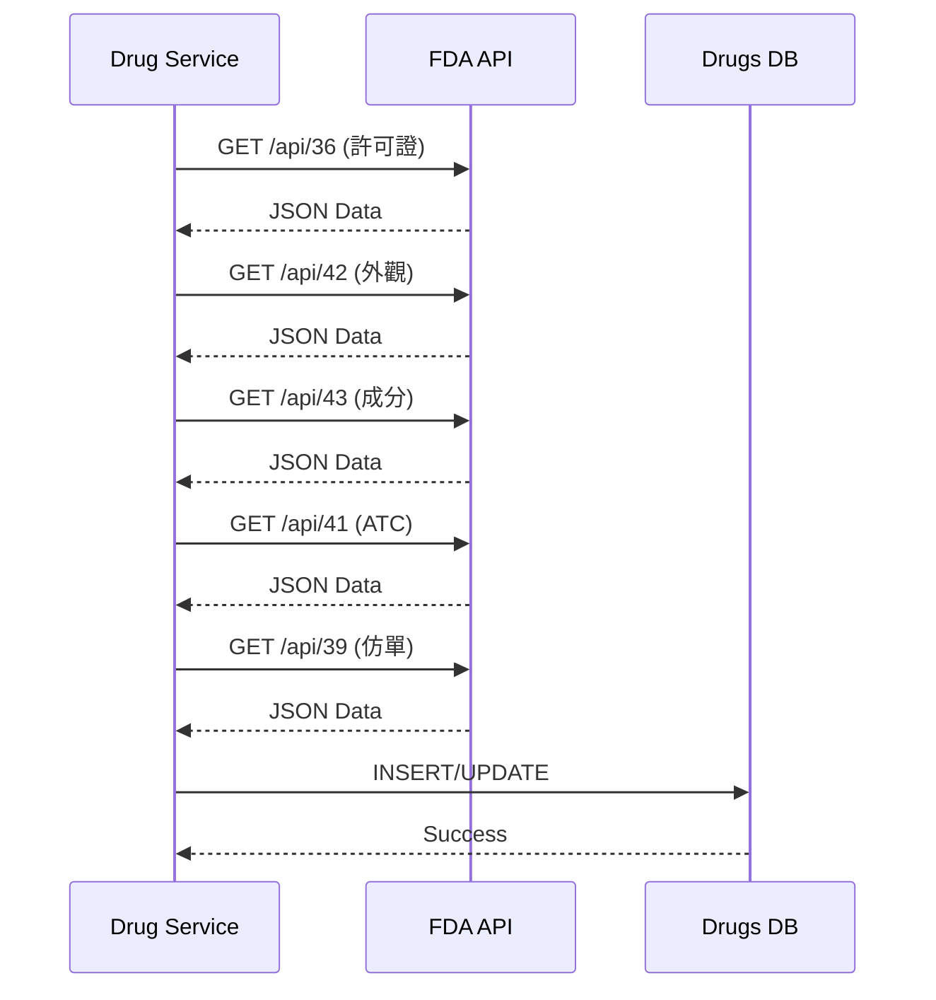

**API 列表**:

| API | 內容 | 更新頻率 |
|-----|------|---------|
| API 36 | 藥品許可證基本資料 | 每日 |
| API 42 | 藥品外觀資料 | 每週 |
| API 43 | 藥品成分資料 | 每日 |
| API 41 | ATC 藥物分類 | 每月 |
| API 39 | 藥品仿單/說明書 | 每週 |

#### LOINC Official

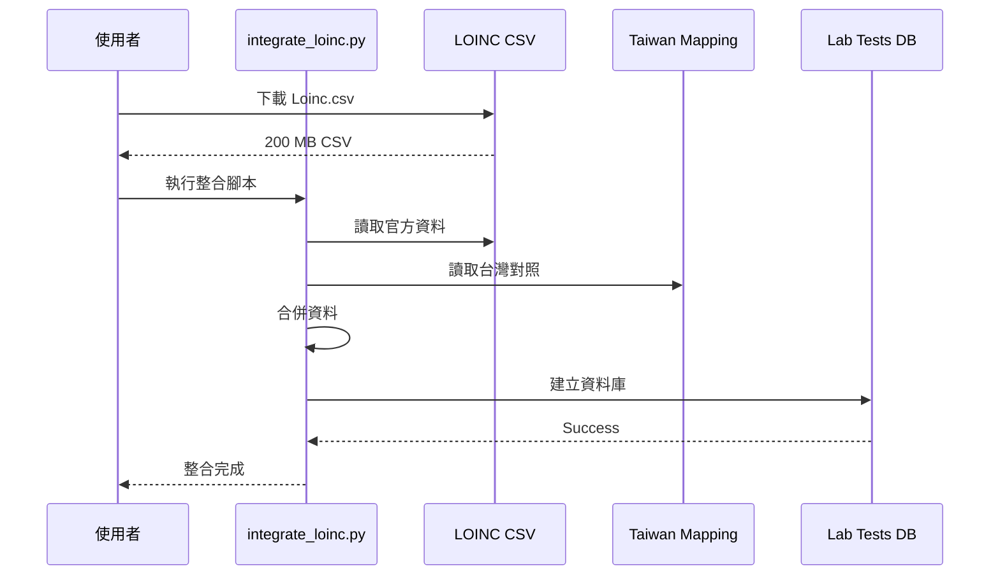

---

## 🔄 資料流程

### 完整診療流程

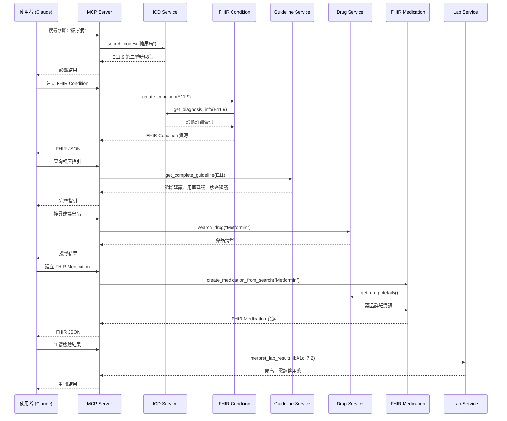

---

## 🔒 安全性設計

### 資料隱私

- ✅ 不儲存患者個人資料
- ✅ FHIR 資源使用假名化 ID
- ✅ 本地資料庫，不上傳雲端

### API 安全

- ✅ 公開 API 資料（FDA, LOINC）
- ✅ 無需 API Key
- ✅ Rate Limiting 機制

### 資料完整性

- ✅ SQLite ACID 特性
- ✅ 資料驗證機制
- ✅ 錯誤處理與日誌

---

## ⚡ 效能優化

### 快取策略

```python
# FTS5 全文檢索索引
CREATE VIRTUAL TABLE diagnosis_fts USING fts5(
    code, name_zh, name_en
);

# 一般索引
CREATE INDEX idx_license_id ON licenses(license_id);
CREATE INDEX idx_loinc_code ON loinc_mapping(loinc_code);
```

### 資料庫優化

- ✅ FTS5 全文檢索
- ✅ 適當的索引設計
- ✅ 查詢優化
- ✅ 連線池管理

---

## 📊 擴展性設計

### 水平擴展

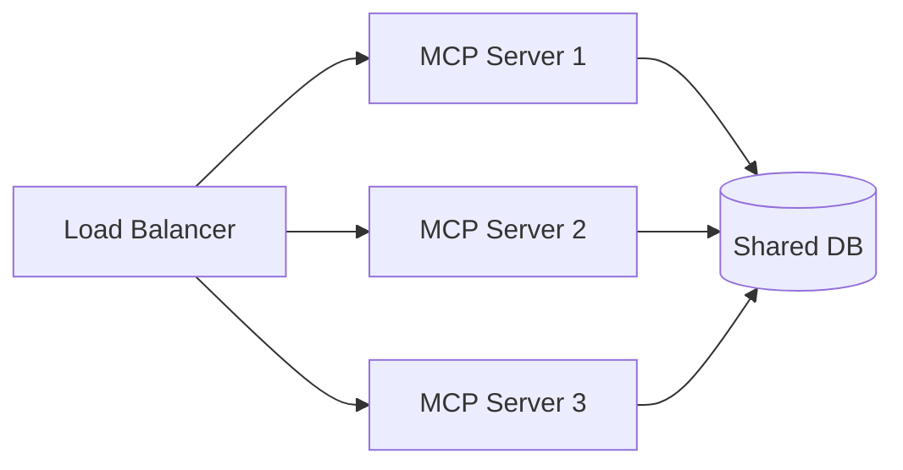

### 垂直擴展

- 增加記憶體 → 更大的快取
- 增加 CPU → 更快的查詢
- SSD 硬碟 → 更快的 I/O

---

## 🔮 未來架構規劃

### Phase 2: 微服務化

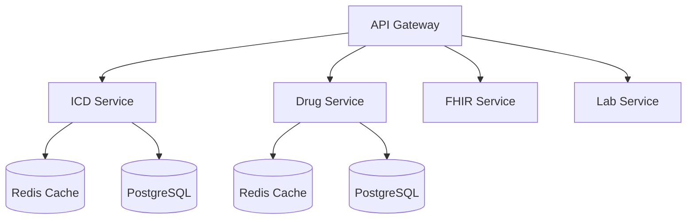

### Phase 3: 雲端部署

- ☁️ Kubernetes 編排
- 🔄 自動擴展
- 📊 分散式追蹤
- 🔐 進階安全機制

---

## 📖 相關文件

- [資料流程圖](data-flow.md)
- [模組關係圖](module-relations.md)
- [部署架構](deployment.md)

---

!!! info "架構演進"
    本架構設計支援從單機部署到雲端微服務的平滑演進。

    當前版本專注於功能完整性與標準化，未來將逐步引入更多企業級特性。
