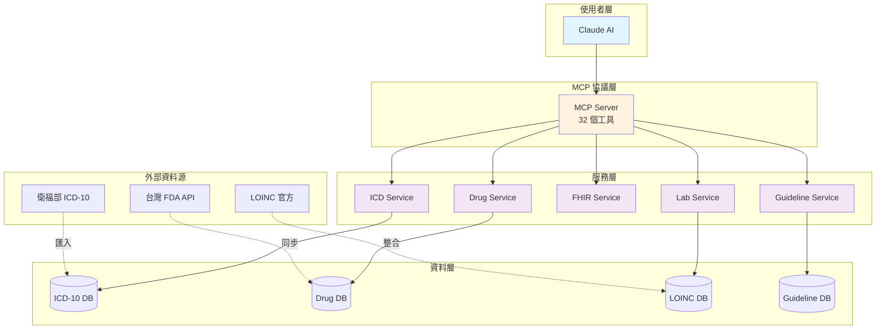

# Taiwan ICD10 Health MCP

<div align="center">

# 🇹🇼 台灣醫療健康資料整合 MCP 伺服器

**整合 ICD-10、FDA 藥品、保健食品、營養資料、LOINC 檢驗、臨床指引，支援 FHIR R4 標準**

[](http://hl7.org/fhir/R4/)
[](https://www.python.org/)
[](https://modelcontextprotocol.io)
[](https://github.com/yourusername/Taiwan-ICD10-Health-MCP/blob/main/LICENSE)

[快速開始](getting-started.md){ .md-button .md-button--primary }
[查看 GitHub](https://github.com/yourusername/Taiwan-ICD10-Health-MCP){ .md-button }

</div>

---

## ✨ 專案特色

<div class="grid cards" markdown>

-   :flag_tw: __台灣在地化__

    ---

    專為台灣醫療環境設計，支援繁體中文，整合台灣官方資料

-   :link: __標準化整合__

    ---

    符合國際 FHIR R4、LOINC、ICD-10、ATC 標準

-   :bar_chart: __官方資料__

    ---

    整合台灣 FDA、衛福部官方開放資料平台

-   :robot: __AI 整合__

    ---

    透過 MCP 協議與 Claude 無縫對接

-   :arrows_counterclockwise: __持續更新__

    ---

    資料可自動同步台灣 FDA API 最新資訊

-   :test_tube: __完整測試__

    ---

    提供完整的測試腳本與使用範例

</div>

---

## 🎯 核心功能

### 1. ICD-10 診斷與手術碼查詢

- ✅ 診斷碼（ICD-10-CM）與手術碼（ICD-10-PCS）搜尋
- ✅ 診斷併發症推論
- ✅ 診斷與手術碼衝突檢查
- ✅ 轉換為 **FHIR Condition** 資源

### 2. 台灣 FDA 藥品資料整合

整合 5 個官方資料集：

- ✅ 藥品許可證（名稱、適應症、製造商）
- ✅ 藥品外觀識別（形狀、顏色、刻痕、圖片）
- ✅ 藥品成分（有效成分、含量）
- ✅ ATC 藥物分類（WHO 標準）
- ✅ 藥品仿單/說明書
- ✅ 轉換為 **FHIR Medication/MedicationKnowledge** 資源

### 3. LOINC 檢驗碼整合

- ✅ LOINC 碼對照（台灣常用 30+ 項，可擴展至 87,000+ 項）
- ✅ 檢驗參考值查詢（依年齡、性別）
- ✅ 檢驗結果自動判讀
- ✅ 批次判讀多項檢驗

### 4. 臨床診療指引

- ✅ 台灣醫學會臨床指引查詢
- ✅ 診斷建議、用藥建議、檢查建議
- ✅ 治療目標與臨床路徑規劃

### 5. FHIR R4 標準轉換

- ✅ **FHIR Condition** - ICD-10 診斷資源
- ✅ **FHIR Medication** - 藥品資源
- ✅ **FHIR MedicationKnowledge** - 藥品知識庫
- ✅ 符合國際醫療資訊交換標準

---

## 📊 系統架構



[查看詳細架構](architecture/system-architecture.md){ .md-button }

---

## 🚀 快速開始

=== "使用 Docker（推薦）"

    ```bash
    # Clone 專案
    git clone https://github.com/yourusername/Taiwan-ICD10-Health-MCP.git
    cd Taiwan-ICD10-Health-MCP

    # 啟動服務
    docker-compose up -d

    # 查看日誌
    docker-compose logs -f
    ```

=== "手動安裝"

    ```bash
    # Clone 專案
    git clone https://github.com/yourusername/Taiwan-ICD10-Health-MCP.git
    cd Taiwan-ICD10-Health-MCP

    # 安裝相依套件
    pip install -r requirements.txt

    # 準備資料（下載 ICD-10 Excel 檔案到 data/ 目錄）

    # 啟動服務
    python src/server.py
    ```

[詳細安裝說明](getting-started.md){ .md-button .md-button--primary }

---

## 💡 使用範例

### 範例 1: 完整診療流程

```python
from icd_service import ICDService
from fhir_condition_service import FHIRConditionService
from clinical_guideline_service import ClinicalGuidelineService

# 1. 搜尋診斷
icd = ICDService('data/icd.xlsx', 'data')
result = icd.search_codes("糖尿病", type="diagnosis")

# 2. 建立 FHIR Condition
fhir = FHIRConditionService(icd)
condition = fhir.create_condition(
    icd_code="E11.9",
    patient_id="patient-001",
    clinical_status="active"
)

# 3. 查詢臨床指引
guideline = ClinicalGuidelineService('data')
pathway = guideline.suggest_clinical_pathway("E11")
```

### 範例 2: 藥品查詢與 FHIR 轉換

```python
from drug_service import DrugService
from fhir_medication_service import FHIRMedicationService

# 1. 搜尋藥品
drug = DrugService('data')
result = drug.search_drug("普拿疼")

# 2. 建立 FHIR Medication
fhir_med = FHIRMedicationService(drug)
medication = fhir_med.create_medication_from_search(
    keyword="普拿疼",
    resource_type="Medication"
)
```

[更多範例](guides/complete-workflow.md){ .md-button }

---

## 🛠️ MCP 工具清單

本服務提供 **32 個 MCP 工具**，分為 10 個群組：

| 群組 | 工具數量 | 主要功能 |
|------|---------|---------|
| ICD-10 工具 | 4 | 診斷/手術碼查詢、併發症推論 |
| 藥品工具 | 3 | 藥品查詢、外觀識別 |
| 健康食品工具 | 2 | 健康食品查詢、分析 |
| 營養工具 | 5 | 營養成分查詢、膳食分析 |
| FHIR 工具 | 7 | FHIR 資源轉換、驗證 |
| 檢驗工具 | 5 | LOINC 查詢、結果判讀 |
| 臨床指引工具 | 5 | 指引查詢、路徑規劃 |
| 綜合分析工具 | 1 | 跨模組整合分析 |

[查看完整工具清單](tools/index.md){ .md-button }

---

## 📚 文件導覽

<div class="grid cards" markdown>

-   :material-file-document: __架構設計__

    ---

    了解系統架構、資料流程、模組關係

    [:octicons-arrow-right-24: 查看架構文件](architecture/index.md)

-   :material-code-braces: __服務模組__

    ---

    深入了解 8 個核心服務模組的實作

    [:octicons-arrow-right-24: 查看模組文件](modules/index.md)

-   :material-api: __API 參考__

    ---

    完整的 API 參考文件與範例

    [:octicons-arrow-right-24: 查看 API 文件](api/index.md)

-   :material-book-open-variant: __使用指南__

    ---

    實用的使用指南與最佳實踐

    [:octicons-arrow-right-24: 查看使用指南](guides/index.md)

-   :material-hospital-box: __FHIR 整合__

    ---

    FHIR R4 標準整合說明

    [:octicons-arrow-right-24: 查看 FHIR 文件](fhir/index.md)

-   :material-hammer-wrench: __開發指南__

    ---

    開發環境設置、測試、貢獻指南

    [:octicons-arrow-right-24: 查看開發文件](development/index.md)

</div>

---

## 📊 資料來源

### 台灣官方資料

- 🇹🇼 衛福部 ICD-10 中文化資料
- 🇹🇼 FDA 藥品資料（5 個 API）
- 🇹🇼 FDA 健康食品資料

### 國際標準

- 🌍 **FHIR R4** - HL7 International
- 🌍 **LOINC** - Regenstrief Institute
- 🌍 **ICD-10** - WHO
- 🌍 **ATC** - WHO

[查看資料來源詳情](data-sources/index.md){ .md-button }

---

## 🤝 貢獻

歡迎貢獻！我們需要：

- 🔹 新增更多 LOINC 中文對照
- 🔹 補充臨床診療指引資料
- 🔹 實作更多 FHIR 資源
- 🔹 改善效能與快取機制

[查看貢獻指南](development/contributing.md){ .md-button }

---

## 📝 授權

本專案採用 **MIT License** - 詳見 [LICENSE](https://github.com/yourusername/Taiwan-ICD10-Health-MCP/blob/main/LICENSE)

---

## 🙏 致謝

感謝以下組織提供開放資料：

- 🇹🇼 中華民國衛生福利部
- 🇹🇼 台灣食品藥物管理署 (TFDA)
- 🌍 Regenstrief Institute (LOINC)
- 🌍 HL7 International (FHIR)
- 🌍 World Health Organization (ICD, ATC)

---

<div align="center">

**⭐ 如果這個專案對您有幫助，請給我們一個 Star！**

[GitHub](https://github.com/yourusername/Taiwan-ICD10-Health-MCP){ .md-button .md-button--primary }

</div>
